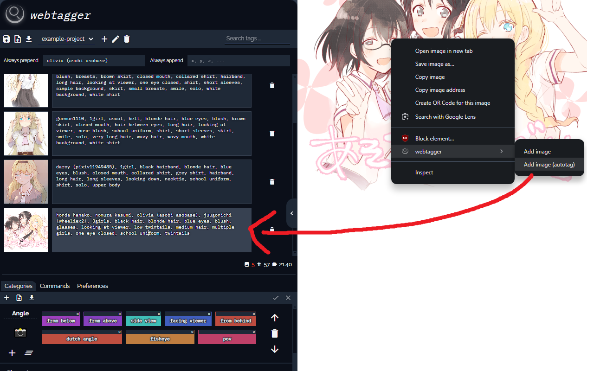
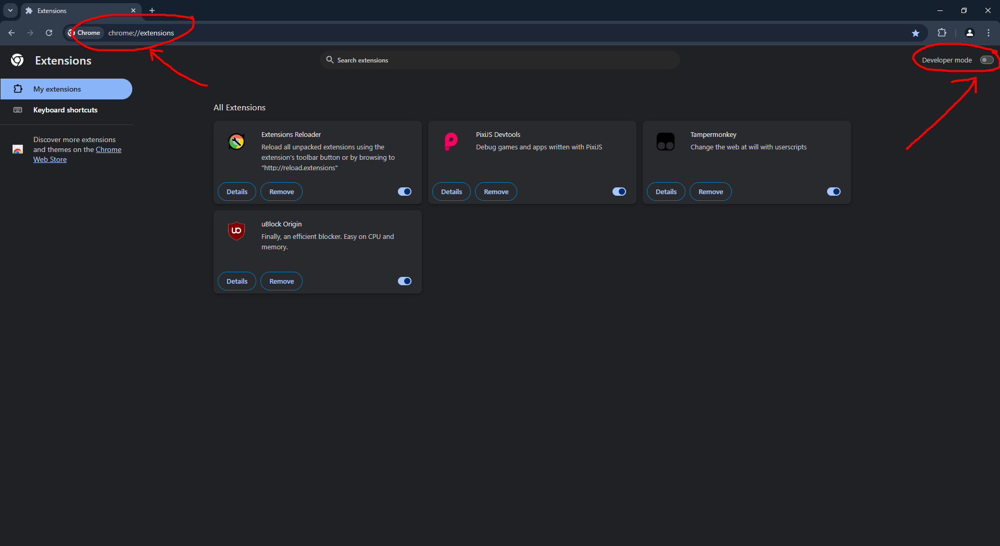
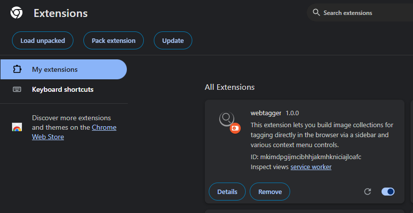
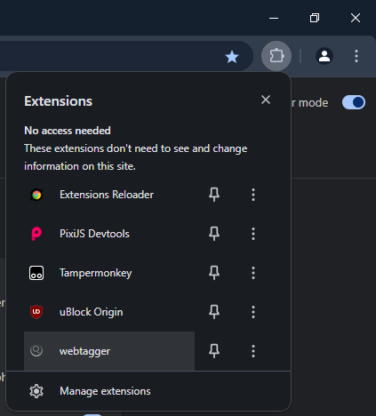

# webtagger
A browser extension that lets you build image collections for tagging directly in the browser via a sidebar and various context menu controls.



## Overview
Auto-tagging via image recognition models is a powerful method for quickly producing metadata for image collections, but sometimes I want to manually tag images to ensure that the data is as accurate as possible. This extension is a power tool for quickly building and iterating over images in a human way, allowing you to categorize your tags, then skim over the images to apply them in bulk.

## Features
- Add images to the sidebar from the context menu
- Auto-tag on booru image pages
- Bulk tag images with multi-image selection
- Tag categories for organizing tags
- Search and filter images by tags
- Export and import datasets
- Advanced programmatic features for power users (documentation coming soon)

## Todo
- [ ] Drag and drop tags onto selection
- [ ] Click to preview full image
- [ ] Undo/Redo command history stack

## Installation

1. First, clone the repository (or download the zip file and extract it wherever you want).
```bash
git clone https://github.com/mkgiga/webtagger.git
```

### Chrome

2. Open the browser extension page by typing `chrome://extensions/` in the address bar and enable the developer mode.



3. Click on the `Load unpacked` button and select the `webtagger` directory.



4. The extension should now be installed and you should see the icon in the browser toolbar. If it's not visible, click on the puzzle icon and pin the extension.



## Usage

### Opening the sidebar
Click on the extension icon in the browser toolbar to open the sidebar. If you don't see the icon, click on the puzzle icon and pin the extension.

### Adding images
Visit any browser tab and right-click an image to see the 'webtagger' option, then click on 'Add image to sidebar'.

### Selecting images
Left click the preview image next to the textbox to select it. Holding CTRL causes the image to be added to your current selection. Holding shift selects a range.

## Tagging images
- Creating tags:
  In the bottom bar exists a tab called 'Categories', in it, press the + button on the menu bar to create a new category.
  With your new category, press the + button below the category emoji to add a new tag.
- Renaming tags:
  Double click the text inside the tag to rename it.
- Applying a tag to an image
  Select any image(s). Now, click the top 'handle' of the tag to select it.
  You can now apply the selected tag to the image selection by either clicking the checkmark on the right of the menu bar, or by single clicking any of the tags (not on the handle because that will deselect it). I am working on drag-and-drop to simplify this confusing design

### Advanced usage
TODO add instructions, (features implemented)

## FAQ
- **Why is the extension not working in Firefox?**
  - It appears that most other browsers (including Firefox) don't fully support manifest v3 service workers yet. I'll look into porting this over or changing to manifest v2.
