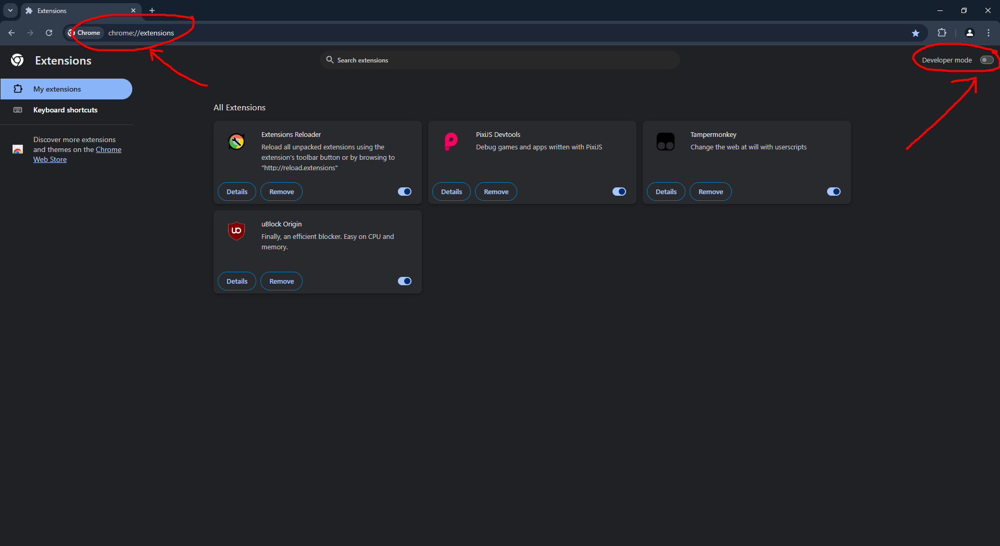
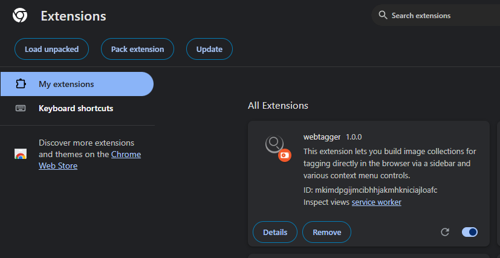
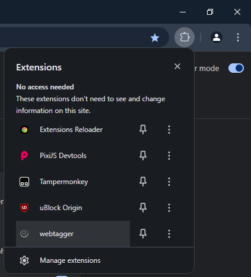

# webtagger
An browser extension that lets you build image collections for tagging directly in the browser via a sidebar and various context menu controls.

## Overview
Auto-tagging via image recognition models is a powerful method for quickly producing metadata for image collections, but sometimes I want to manually tag images to ensure that the data is as accurate as possible. This extension is a power tool for quickly building and iterating over images in a human way, allowing you to categorize your tags, then skim over the images to apply them in bulk.

## Installation

1. First, clone the repository (or download the zip file and extract it wherever you want).
```bash
git clone https://github.com/mkgiga/webtagger.git
```

### Chrome

2. Open the browser extension page by typing `chrome://extensions/` in the address bar and enable the developer mode.



3. Click on the `Load unpacked` button and select the `webtagger` directory.



4. The extension should now be installed and you should see the icon in the browser toolbar. If it's not visible, click on the puzzle icon and pin the extension.



## Usage

### Opening the sidebar
Click on the extension icon in the browser toolbar to open the sidebar. If you don't see the icon, click on the puzzle icon and pin the extension.
### Adding images
Visit any browser tab and right-click an image to see the 'webtagger' option, then click on 'Add image to sidebar'.
### Tagging images
TODO add instructions, (feature is implemented)
### Advanced usage
TODO add instructions, (feature is implemented)

## FAQ
- **Why is the extension not working in Firefox?**
  - It seems that most other browsers (including Firefox) don't fully support manifest v3 service workers yet. I'll look into porting this over or changing to manifest v2.